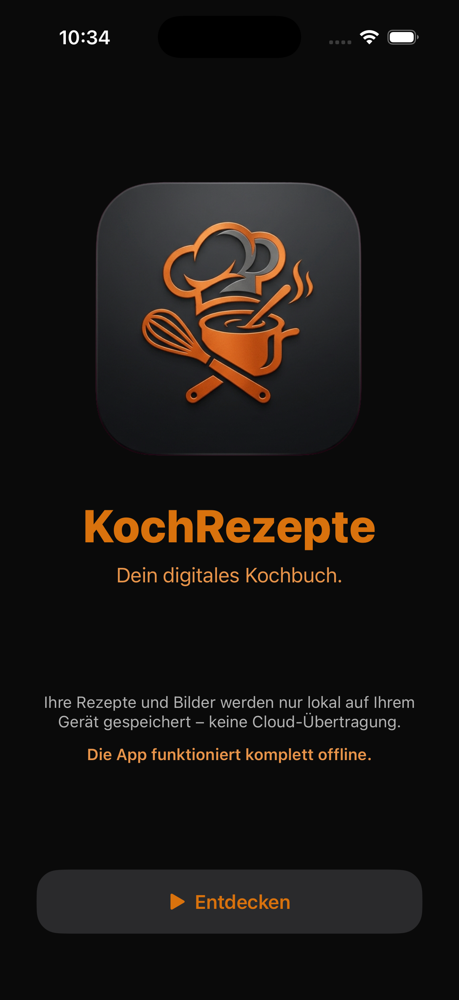
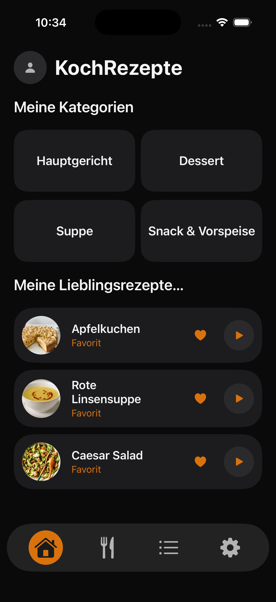
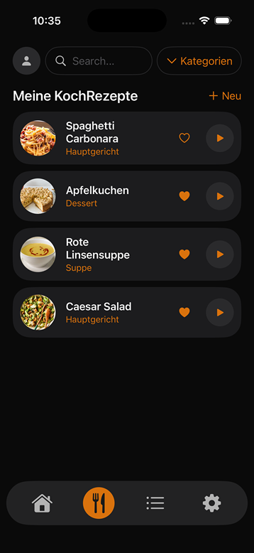
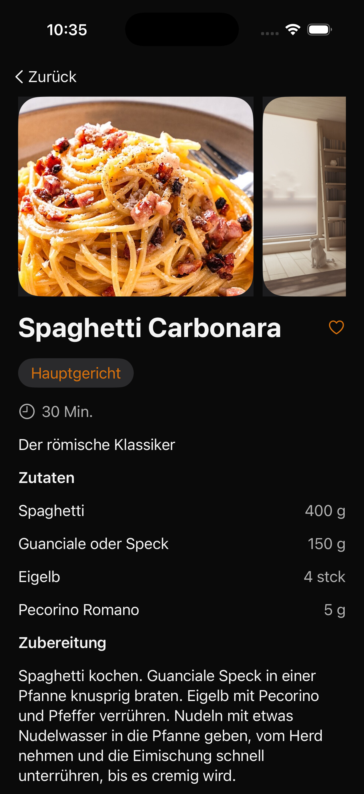
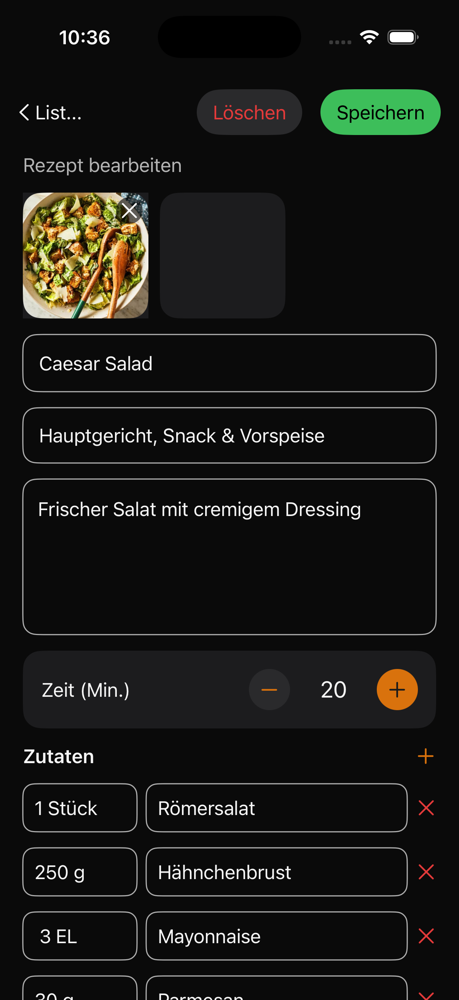
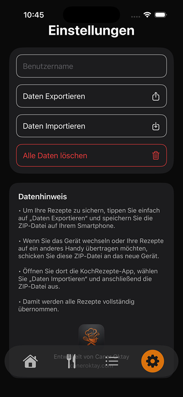

# KochRezepte – Dein digitales Kochbuch


**KochRezepte** ist eine native Android-Anwendung zum Erfassen, Organisieren und
Nachschlagen eigener Kochrezepte. Rezepte werden mit Titel, Beschreibung,
Zutatenliste, Zubereitungsschritten, Kategorien, Fotos und externen Links
(z. B. YouTube-Anleitungen) gepflegt – vollständig offline und ohne Cloud-Anbindung.

> ⚠️ **Hinweis:** Alle Rezepte, Kategorien und Bilder werden ausschließlich lokal
> auf dem Gerät gespeichert. Es besteht keinerlei Verbindung zu einem Server
> oder einer Cloud – die App funktioniert komplett offline.

---

## 📱 Screenshots

      

   

   

---

## ✨ Funktionen

* Rezepte erstellen, bearbeiten und löschen
* Kategorien verwalten
* Favoriten markieren
* Fotos hinzufügen (Kamera & Galerie)
* Automatische Bildspeicherung
* JSON‑basierte Datenspeicherung
* Datenexport & Import (Backup)
* Moderne SwiftUI‑Oberfläche
* Klare MVVM‑Struktur mit Storage‑Layer

---

## 📂 Projektstruktur

Die App ist übersichtlich in Module gegliedert:

* **Models/** – Datenmodelle für Rezepte und Kategorien
* **Store/** – RecipeStore (ViewModel + Repository)
* **Storage/** – JSON‑Speicher, Bildspeicher, Backup‑Manager
* **Views/** – SwiftUI‑Screens
* **Navigation/** – Router
* **Theme/** – Farben, Icons, Styles
* **Assets.xcassets/** – App‑Grafiken

---

## 🛠 Verwendete Technologien

* SwiftUI
* Combine
* MVVM
* JSONEncoder / JSONDecoder
* ZIPFoundation
* Xcode 15+

---

## 📦 Installation

Repository klonen:

```
git clone https://github.com/caneroktay/KochRezepte.git
```

Projekt öffnen:

```
KochRezepte.xcodeproj
```

Build & Run im Simulator oder auf einem echten Gerät.

---

## 🧩 Datenspeicherung

Die App speichert alle Daten lokal:

* **RecipeJSONStorage** – Rezeptdatenbank
* **ImageStorageManager** – Bilddateien
* **BackupManager** – Export/Import als JSON‑ZIP

    
## 📄 Lizenz

Dieses Projekt steht unter der **MIT-Lizenz** – siehe [LICENSE](license.txt) für Details.
Dieses Projekt dient Lern‑ und Entwicklungszwecken.

---

## 👨‍💻 Entwickler

**Caner Oktay**

---

*Entwickelt mit ❤️ für alle, die ihre Rezepte an einem Ort sammeln möchten*


